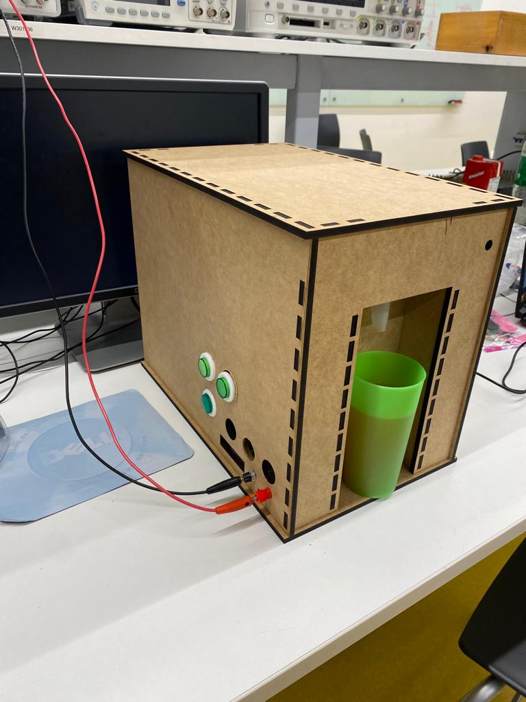
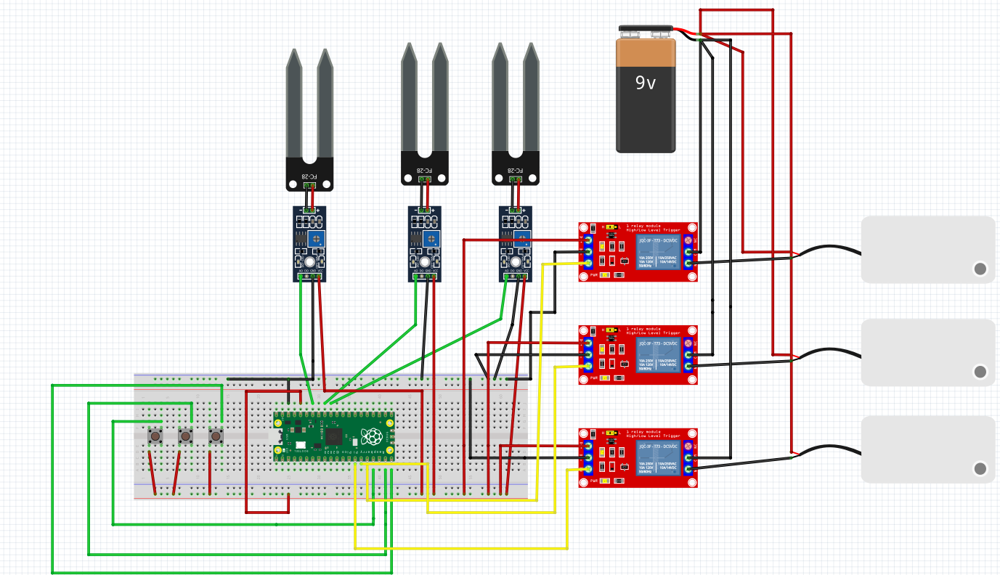
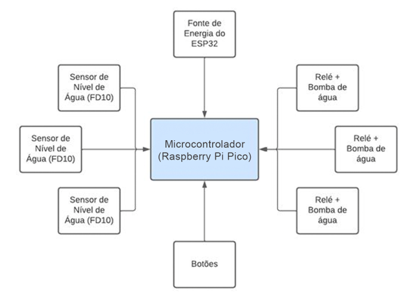
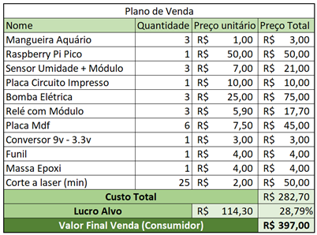

# *Drinker* de bebidas

Este projeto consiste na criação de um *drinker* de bebidas utilizando o *Raspberry Pi Pico*. 
Em outras palavras, consiste no usuário selecionar um dos três botões, onde cada botão representa uma mistura de bebida diferente, e será despejada a combinação escolhida assim que pressionado.
Foi utilizado MicroPython como linguagem de programação no desenvolvimento do software.

# Esquema elétrico
O arquino do esquema elétrico está na pasta */esquema-elétrico/DiagramaElétrico*

Uma foto do mesmo pode ser encontrada abaixo

# Diagrama de blocos

# Requisitos

# Materiais utilizados
- 3 relés
- 2 conversores A/D
- 3 sensores de umidade
- 3 garrafas
- 3 bombas de aquário
- 1 protoboard
- 2 receptores de banana-banana
- 3 botões de fliperama
- Cabo microusb
- MDF

# Elaboração do corpo em MDF
- Escolhemos o MDF por ser um material leve e disponibilizado facilmente pelo Instituto Mauá de Tecnologia, faculdade onde estudamos.
- Fizemos o envoltório/corpo através do FabLab, utilizando o corte a laser. 
- O plano de corte desenvolvido está na pasta */plano-corte/PlanoDeCorte*

# Funcionamento/Comportamento desenvolvido

- No clique do botão 1: acionar garrafas 1 e 2.
- No clique do botão 2: acionar garrafas 2 e 3.
- No clique do botão 3: acionar garrafas 3 e 1.

- Em cada garrafa existe um sensor de umidade que servirá de controle para o acionamento das bombas. 

- Por exemplo, acionei o botão 1 mas não tenho bebida suficiente, seja bebida 1 e/ou 2, para completar a dose. Portanto, neste caso, não será despejado nenhuma bebida em seu copo.

- Portanto, além do usuário apertar o botão, é feito essa verificação.

# Vídeo demonstrativo
<video>
    <source src="assets/video.mp4" type="video/mp4">
</video>
Caso o vídeo não esteja sendo exibido, está na pasta *assets/video.mp4*

# Análise de custo

# Autores
- Davi Fernandes Simões Soares      RA: 20.01099-0
- Felipe Matos Silvieri				RA: 20.00314-5
- Gabriel dos Santos Couto			RA: 20.00273-4

# Ideias para o futuro
- Display OLED para retornar ao usuário o motivo de sua bebida não ter sido feita.
- Utilização de cartão com tecnologia RFID, como alternativa aos botões.
- Desenvolvimento de app para a seleção de bebida.
